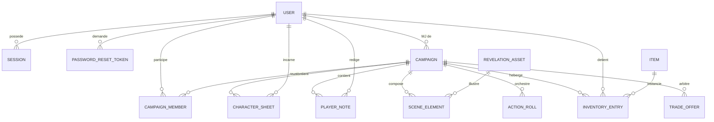

# Modèle de données — MCD, MPD, dictionnaire & intégrité

*Compétences visées : C14 (MCD + règles de gestion), C10 (intégrité BDD), C4 (persistance découplée), C13 (dictionnaire de données), C32 (analyse organique).*

> **Ce document est calé sur le schéma Prisma réellement déployé**
> (`apps/server/prisma/schema.prisma`), et remplace la modélisation « NewMJ » antérieure
> qui ne correspondait plus au code.

## 1. Règles de gestion

- RG1 — Un **utilisateur** a un email et un pseudo **uniques**.
- RG2 — Un utilisateur peut participer à plusieurs campagnes ; dans chacune il a **un seul rôle** (`GM` ou `PLAYER`) — unicité `(campaignId, userId)`.
- RG3 — Une **campagne** a exactement **un MJ** (`gmUserId`) et un **code de partie unique**.
- RG4 — Une campagne passe par les états `DRAFT → ACTIVE → CLOSED` (`CampaignStatus`).
- RG5 — Un **joueur** possède **au plus une fiche** de personnage par campagne — unicité `(userId, campaignId)`.
- RG6 — Un joueur a **au plus une note privée** par campagne — unicité `(userId, campaignId)`.
- RG7 — Un **élément de scène** appartient à une campagne ; sa visibilité est contrôlée (`isVisible`).
- RG8 — Une **demande de jet** appartient à une campagne, cible un joueur, un élément ou rien, et porte des conséquences par issue.
- RG9 — Une **entrée d'inventaire** relie un objet (`Item`), un joueur et une campagne, avec une quantité ≥ 0.
- RG10 — Une **offre d'échange** relie deux joueurs d'une même campagne et référence les objets offerts/demandés ; états `PENDING/ACCEPTED/REFUSED/CANCELLED`.
- RG11 — La suppression d'un utilisateur ou d'une campagne **cascade** sur ses données rattachées (sessions, membres, fiches, notes, inventaire…).

## 2. MCD (conceptuel)

## 3. MPD (modèle physique cible — PostgreSQL via Prisma)

Types clés (extrait) :

- Clés primaires `uuid` (`@default(uuid())`).
- Enums PostgreSQL natifs : `AccountStatus, CampaignStatus, MemberRole, SceneElementType, ItemType, TradeStatus, ActionRollStatus, ActionRollTargetType, ActionRollConsequenceType`.
- Horodatage `createdAt`/`updatedAt` (`@default(now())`, `@updatedAt`).

## 4. Dictionnaire de données (extrait des tables sensibles)

**User**
| Champ | Type | Contrainte | Sens |
|---|---|---|---|
| id | uuid | PK | Identifiant compte |
| email | string | **UNIQUE**, not null | Email de connexion (stocké en minuscules) |
| username | string | **UNIQUE**, not null | Pseudo affiché |
| passwordHash | string | not null | `sel:dérivée` (scrypt), jamais en clair |
| status | AccountStatus | défaut `ACTIVE` | Compte actif/désactivé |

**Session**
| Champ | Type | Contrainte | Sens |
|---|---|---|---|
| tokenHash | string | **UNIQUE** | SHA-256 du token de session (jamais le token brut) |
| userId | uuid | FK→User, **onDelete: Cascade** | Propriétaire |
| expiresAt | datetime | index | Expiration (7 j) |

**CampaignMember**
| Champ | Contrainte | Sens |
|---|---|---|
| (campaignId, userId) | **UNIQUE** | Un rôle unique par personne et campagne (RG2) |
| role | enum MemberRole | GM / PLAYER |

**ActionRoll** (extrait) : `dieSides`, `totalFailureMax`, `successMin`, `totalSuccessMin`,
conséquences par issue (`*ConsequenceType/Amount/Text`), `result`, `status`.

*(Dictionnaire complet : le schéma `schema.prisma` fait foi et est versionné.)*

## 5. Contraintes d'intégrité (C10)

**Déjà présentes dans le schéma :**
- **Unicité** : `User.email`, `User.username`, `Campaign.joinCode`, `Session.tokenHash`,
  `(campaignId, userId)` sur membres/fiches/notes.
- **Clés étrangères** avec **actions référentielles** : `onDelete: Cascade` (sessions, membres,
  fiches, notes, inventaire, offres) et `onDelete: SetNull` (`SceneElement.assetId`).
- **Énumérations** : valeurs de domaine contraintes au niveau SGBD (statuts, rôles, types).
- **Index** de performance : `Session.expiresAt`, `CampaignMember(campaignId, role)`,
  `InventoryEntry(campaignId, userId)`, etc.

**Ajoutées pour le référentiel (migration `..._integrity_triggers`)** :
- **CHECK** : `CharacterSheet.hp >= 0` et `hp <= maxHp`, `InventoryEntry.quantity >= 0`,
  `SceneElement.hp >= 0`.
- **TRIGGER** : `trg_character_sheet_hp_guard` qui **borne les PV** (`hp` clampé dans
  `[0, maxHp]`) avant chaque `INSERT/UPDATE`, garantissant l'invariant même en cas d'accès
  direct à la base (défense au plus près de la donnée).

Voir le script dans `apps/server/prisma/migrations/<date>_integrity_triggers/migration.sql`.

**Gestion des erreurs d'accès sans interruption** : les violations de contrainte remontent en
exception Prisma, interceptées par le middleware d'erreurs (`app.ts`) qui renvoie un code HTTP
propre (`400/409/500`) et **journalise** sans faire tomber le service.

## 6. Persistance découplée du stockage (C4)

- L'accès aux données passe **exclusivement** par le **Prisma Client** (`lib/prisma.ts`), qui
  abstrait le SGBD : le code métier manipule des objets typés, pas du SQL.
- Le **provider est configurable** (`datasource db { provider = "postgresql"; url = env("DATABASE_URL") }`)
  → changer d'instance (local Docker ↔ Neon) ne touche aucune ligne de code applicatif.
- **Séparation métier / données** : les routes expriment des règles ; la traduction en requêtes
  est déléguée à Prisma ; le schéma porte les invariants structurels. Une évolution du stockage
  (partitionnement, réplique lecture) resterait invisible pour les couches supérieures.
