# Maquettes

Maquettes des écrans de Grimoire, dans l'ordre du parcours utilisateur.
Chaque image est un rendu PNG (2880×2048) exporté depuis les planches de design.

## 1. Login

Connexion et création de compte.

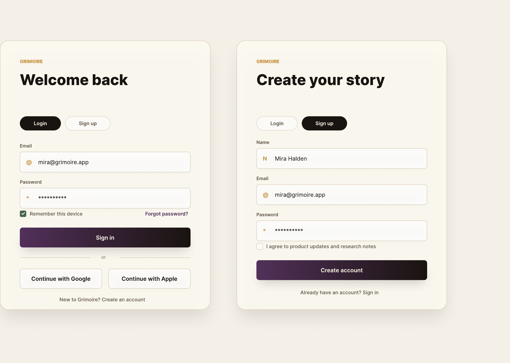

## 2. Dashboard post-login

Écran d'accueil une fois connecté : accès aux campagnes.

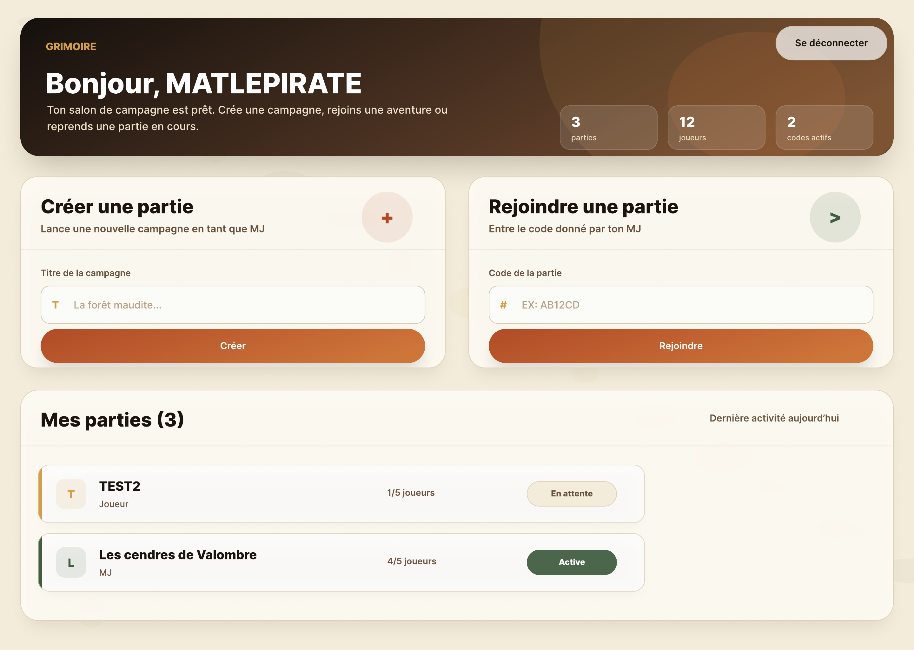

## 3. Lancement de partie

Mise en place d'une partie par le meneur de jeu.

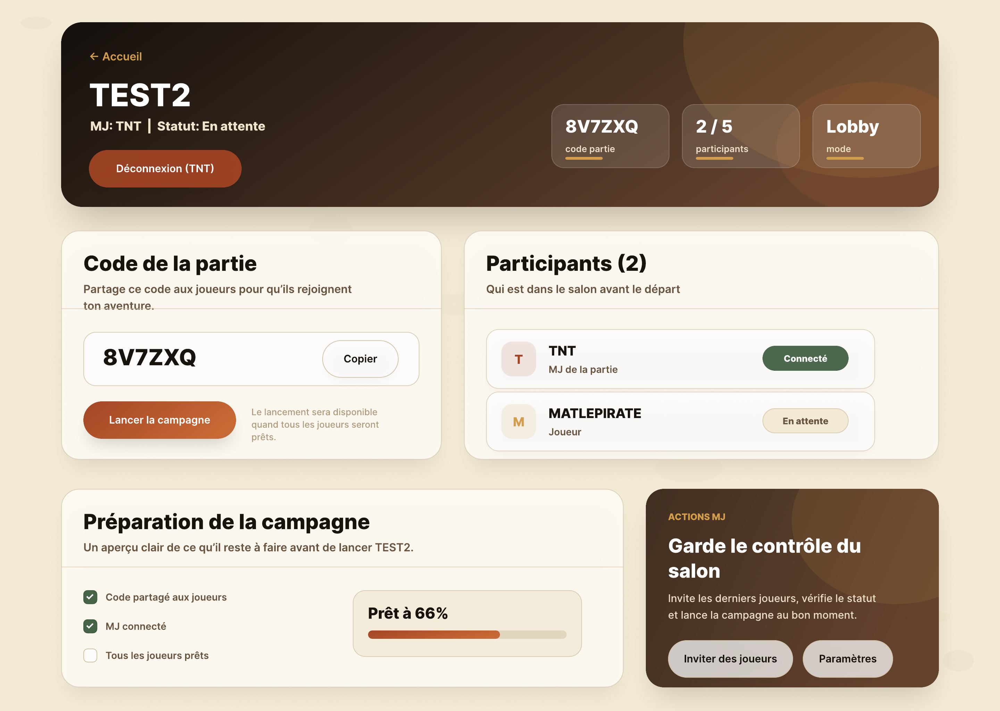

## 4. Choix du personnage

Sélection du personnage joué dans la campagne.

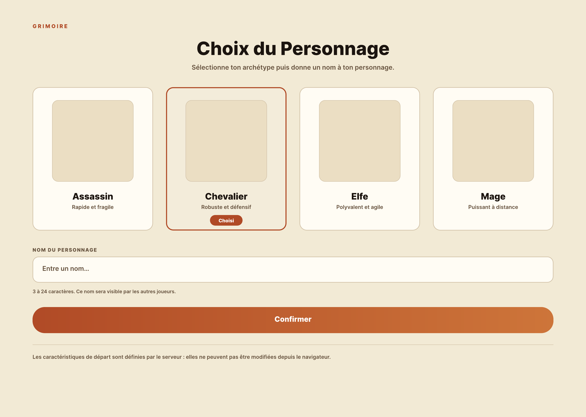

## 5. Fiche de personnage

Caractéristiques, état et équipement du personnage.

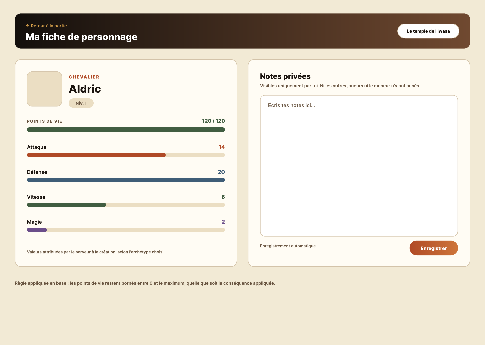

## 6. Scène en direct (joueur)

Vue joueur de la scène en cours, alimentée en temps réel.

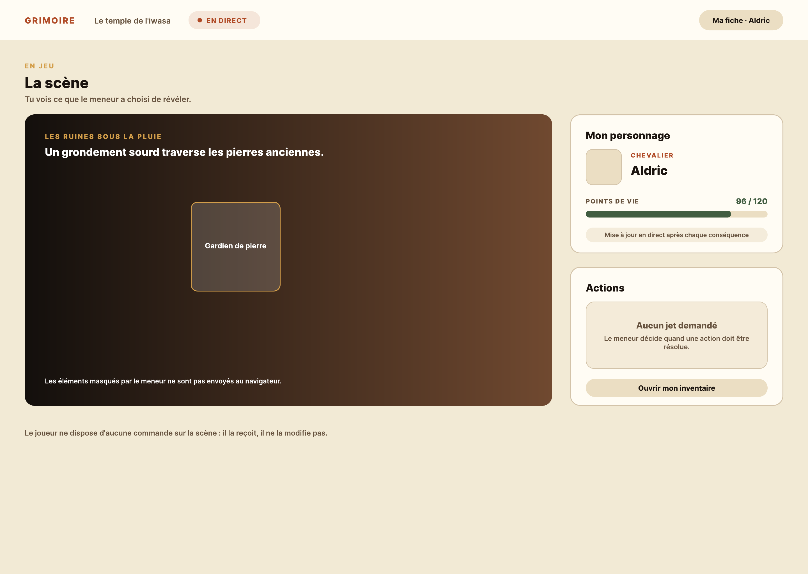

## 7. Régie de scène (MJ)

Vue meneur : pilotage des éléments de la scène.

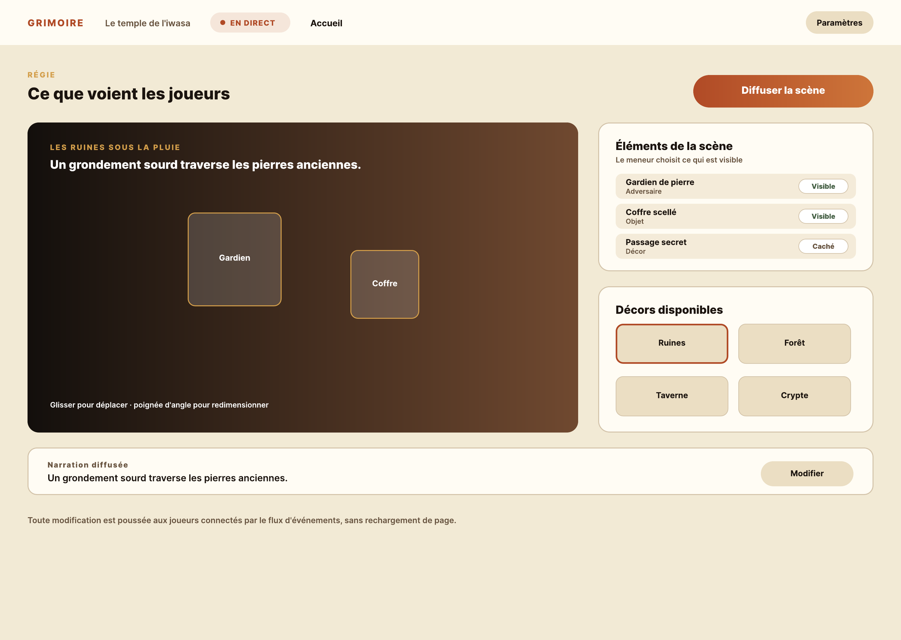

## 8. Résolution d'action (MJ)

Arbitrage d'une action déclarée par un joueur.

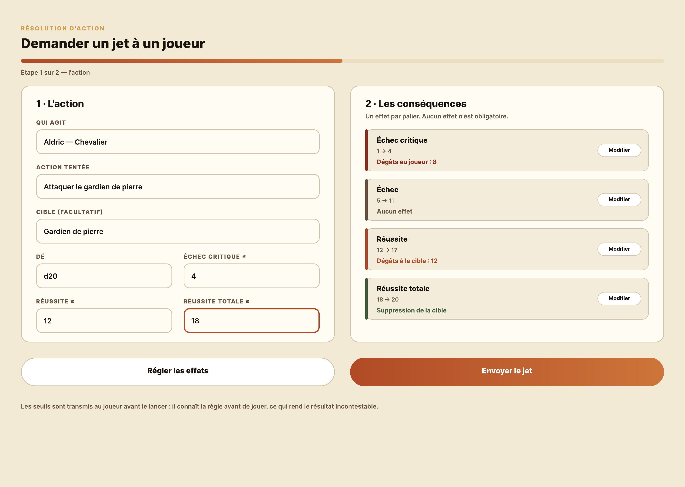

## 9. Jet de dés (joueur et MJ)

Boucle complète du jet : demande du MJ, lancer du joueur, validation du MJ.

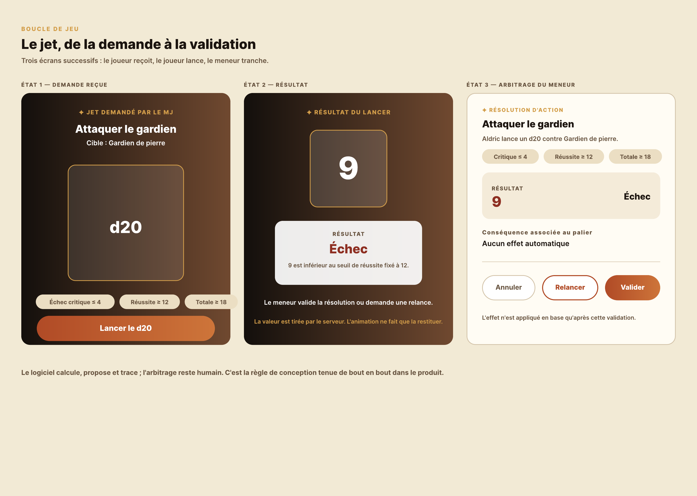

## 10. Inventaire et échange d'objets

Gestion de l'inventaire et transferts d'objets entre personnages.

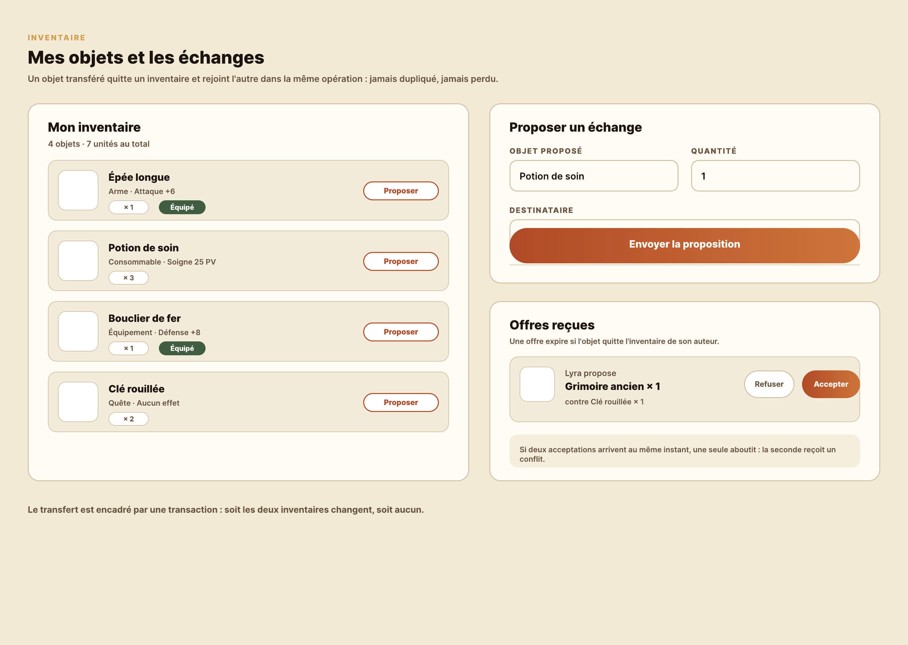

## 11. Système et accessibilité

Principes transverses : design system et accessibilité (RGAA).

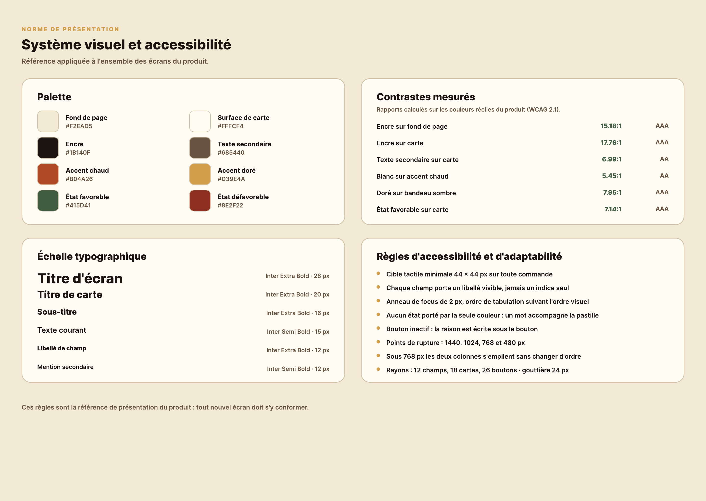
