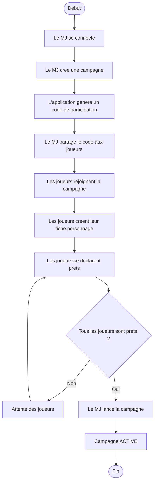

# Diagramme d'activite - lancement de campagne

## Objectif

Representer le workflow fonctionnel allant de la creation d'une campagne a son lancement.

## Competences demontrees

- Analyse fonctionnelle
- Formalisation d'un processus metier
- Validation des conditions de lancement

