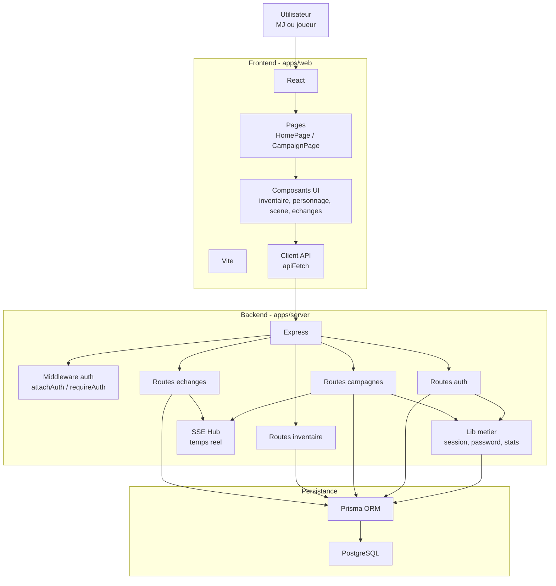

# Architecture applicative

## Objectif

Montrer l'organisation technique de l'application en couches.

## Competences demontrees

- Definition d'une architecture logicielle
- Developpement d'une application securisee organisee en couches
- Separation frontend, backend, ORM et base de donnees
- Mise en place d'un environnement de travail coherent

## Choix techniques

- React et Vite pour une interface web rapide a developper.
- Express pour exposer une API HTTP.
- Prisma pour structurer les acces aux donnees.
- PostgreSQL pour une base relationnelle robuste.
- SSE pour synchroniser les actions de campagne en temps reel.

