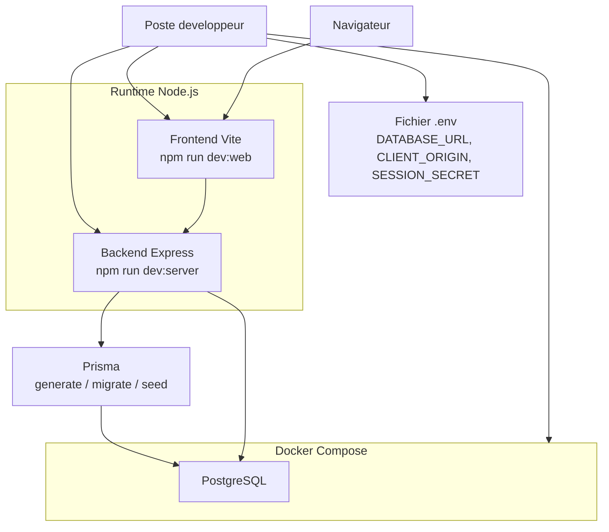

# Diagramme de deploiement local

## Objectif

Montrer comment l'application est lancee et testee en environnement local.

## Competences demontrees

- Installation et configuration de l'environnement de travail
- Preparation du deploiement
- Utilisation de Docker pour la base de donnees
- Documentation technique exploitable

## Scripts utiles

- `npm.cmd install`
- `docker compose up -d`
- `npm.cmd run prisma:generate`
- `npm.cmd run prisma:migrate`
- `npm.cmd run prisma:seed`
- `npm.cmd run dev:server`
- `npm.cmd run dev:web`
- `npm.cmd run check`
- `npm.cmd run build`

