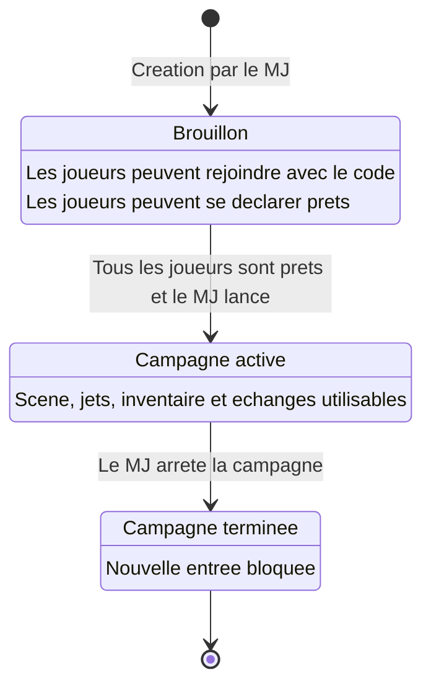

# Diagramme d'etats - campagne

## Objectif

Montrer le cycle de vie d'une campagne dans le MVP.

## Competences demontrees

- Formalisation des etats applicatifs
- Regles de transition
- Conception de composants metier

## Etats presents dans Prisma

- `DRAFT`
- `ACTIVE`
- `CLOSED`

