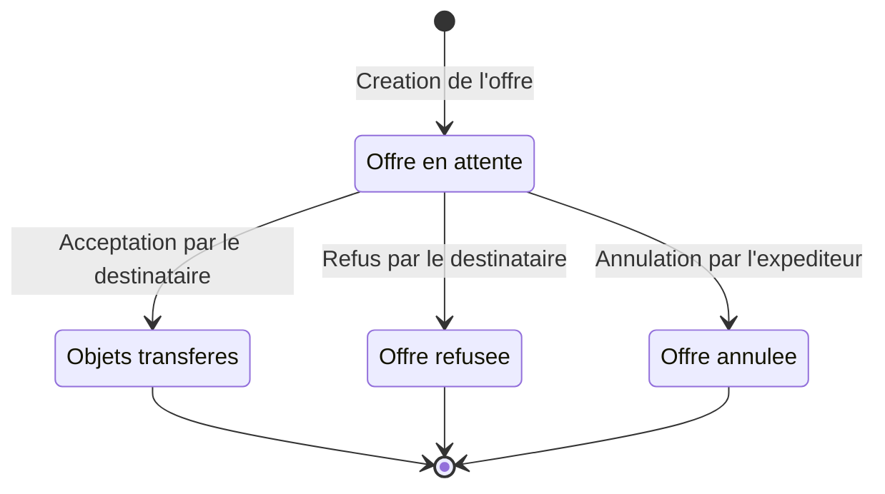

# Diagramme d'etats - offre d'echange

## Objectif

Montrer le cycle de vie d'une offre d'echange entre joueurs.

## Competences demontrees

- Workflow metier
- Gestion des statuts
- Validation des transitions

## Etats presents dans Prisma

- `PENDING`
- `ACCEPTED`
- `REFUSED`
- `CANCELLED`

