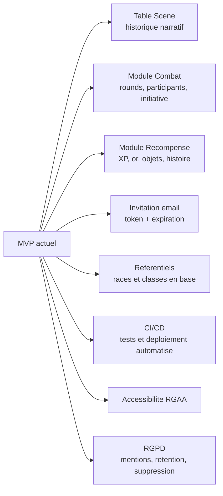

# Evolutions V2

## Objectif

Presenter les evolutions possibles sans les confondre avec le MVP implemente.

## Competences demontrees

- Recul technique
- Capacite a identifier les limites d'un MVP
- Projection d'une architecture evolutive

## A presenter comme limites maitrisees

- La scene courante est stockee directement sur la campagne ; une V2 pourrait historiser les scenes.
- Les combats sont aujourd'hui representes par les jets d'action ; une V2 pourrait ajouter un module combat complet.
- Les recompenses sont gerees par les objets et l'inventaire ; une V2 pourrait ajouter une table dediee.
- Les invitations sont gerees par code de campagne ; une V2 pourrait ajouter des invitations par email.

