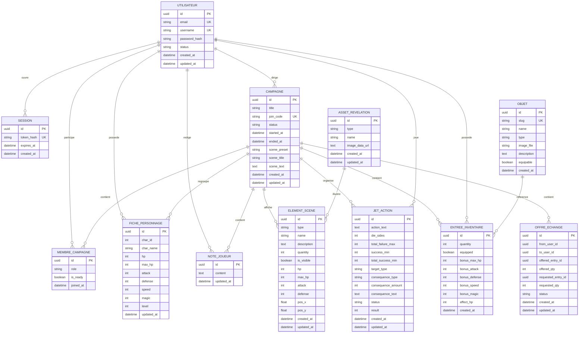

# Grimoire / NewMJ - MCD, MLD et MPC

Date de mise a jour : 2026-07-01

## Source d'analyse

Ce document est aligne sur le schema Prisma actuel :

- `apps/server/prisma/schema.prisma`
- base cible : PostgreSQL
- ORM : Prisma
- backend : Node.js / Express

Le precedent document etait base sur le besoin initial. Il n'etait plus a jour car le projet contient maintenant un modele de donnees reel avec les entites suivantes :

- utilisateurs et sessions
- campagnes et membres
- fiches personnages
- notes privees
- elements de scene
- jets d'action
- inventaire
- echanges d'objets
- assets visuels

## Precision sur le terme MPC

Dans les attendus de dossier, le terme `MPC` est souvent utilise de maniere variable selon les centres. Dans ce document, il est interprete comme le modele physique cible, proche d'un `MPD`.

Le document contient donc :

- un `MCD` : modele conceptuel de donnees, oriente metier
- un `MLD` : modele logique relationnel
- un `MPC / MPD` : modele physique aligne avec Prisma et PostgreSQL

## Regles de gestion principales

- Un utilisateur possede un compte unique identifie par son email et son pseudo.
- Un utilisateur peut etre MJ dans une campagne et joueur dans une autre.
- Une campagne possede un MJ principal.
- Une campagne contient plusieurs membres.
- Un membre a un role dans la campagne : `GM` ou `PLAYER`.
- Un utilisateur ne peut etre membre qu'une seule fois dans une meme campagne.
- Une campagne peut etre en brouillon, active ou fermee.
- Un joueur peut avoir une seule fiche personnage par campagne.
- Un joueur peut avoir une note privee par campagne.
- Le MJ controle les elements visibles dans la scene.
- Les joueurs ne voient que les elements de scene dont `isVisible` vaut `true`.
- Les jets d'action sont rattaches a une campagne et a un joueur.
- Un jet d'action peut cibler un joueur ou un element de scene.
- Une consequence de jet peut ajouter de la narration, infliger des degats ou supprimer une cible.
- Les objets sont references dans un catalogue.
- L'inventaire associe un objet a un joueur dans une campagne.
- Les echanges d'objets sont rattaches a une campagne et passent par un statut.

## MCD - Entites conceptuelles

### Utilisateur

Compte applicatif permettant de se connecter a l'application.

Attributs principaux :

- identifiant
- email
- pseudo
- mot de passe chiffre
- statut du compte
- dates de creation et modification

### Session

Session serveur permettant de maintenir l'authentification avec un cookie `HttpOnly`.

Attributs principaux :

- identifiant
- token chiffre
- date d'expiration
- date de creation

### Campagne

Partie de jeu de role geree par un maitre du jeu.

Attributs principaux :

- identifiant
- titre
- code de participation
- statut
- date de lancement
- date de cloture
- scene courante

### Membre de campagne

Association entre un utilisateur et une campagne.

Attributs principaux :

- role dans la campagne
- etat pret / non pret
- date d'arrivee

### Fiche personnage

Personnage joue par un utilisateur dans une campagne.

Attributs principaux :

- nom
- type visuel de personnage
- points de vie
- attaque
- defense
- vitesse
- magie
- niveau

### Note joueur

Note privee d'un utilisateur dans une campagne.

Attributs principaux :

- contenu
- date de modification

### Element de scene

Element affiche ou gere dans la scene courante : ennemi, PNJ, objet, narration ou joueur.

Attributs principaux :

- type
- nom
- description
- quantite
- visibilite
- statistiques de combat
- position dans la scene
- asset visuel associe

### Jet d'action

Demande de jet lancee par le MJ et resolue par un joueur.

Attributs principaux :

- joueur concerne
- texte de l'action
- type de de
- seuils de resultat
- cible
- consequences
- statut
- resultat

### Objet

Element du catalogue d'objets disponible dans l'application.

Attributs principaux :

- identifiant technique
- nom
- type
- image
- description
- caractere equipable

### Entree d'inventaire

Association entre un joueur, un objet et une campagne.

Attributs principaux :

- quantite
- etat equipe / non equipe
- bonus de statistiques
- effet de soin

### Offre d'echange

Proposition d'echange d'objet entre deux joueurs d'une meme campagne.

Attributs principaux :

- expediteur
- destinataire
- objet propose
- quantite proposee
- objet demande
- quantite demandee
- statut

### Asset de revelation

Image stockee pour illustrer un element de scene.

Attributs principaux :

- type
- nom
- image encodage data URL

## MCD - Diagramme conceptuel



## MLD - Modele logique relationnel

Notation :

- `PK` : cle primaire
- `FK` : cle etrangere
- `UK` : contrainte d'unicite

### USER

`USER` (
`id` PK,
`email` UK,
`username` UK,
`passwordHash`,
`status`,
`createdAt`,
`updatedAt`
)

### SESSION

`SESSION` (
`id` PK,
`tokenHash` UK,
`userId` FK -> `USER.id`,
`expiresAt`,
`createdAt`
)

### CAMPAIGN

`CAMPAIGN` (
`id` PK,
`gmUserId` FK -> `USER.id`,
`title`,
`joinCode` UK,
`status`,
`startedAt`,
`endedAt`,
`createdAt`,
`updatedAt`,
`scenePreset`,
`sceneTitle`,
`sceneText`
)

### CAMPAIGN_MEMBER

`CAMPAIGN_MEMBER` (
`id` PK,
`campaignId` FK -> `CAMPAIGN.id`,
`userId` FK -> `USER.id`,
`role`,
`isReady`,
`joinedAt`,
UK (`campaignId`, `userId`)
)

### CHARACTER_SHEET

`CHARACTER_SHEET` (
`id` PK,
`userId` FK -> `USER.id`,
`campaignId` FK -> `CAMPAIGN.id`,
`charId`,
`charName`,
`hp`,
`maxHp`,
`attack`,
`defense`,
`speed`,
`magic`,
`level`,
`updatedAt`,
UK (`userId`, `campaignId`)
)

### PLAYER_NOTE

`PLAYER_NOTE` (
`id` PK,
`userId` FK -> `USER.id`,
`campaignId` FK -> `CAMPAIGN.id`,
`content`,
`updatedAt`,
UK (`userId`, `campaignId`)
)

### SCENE_ELEMENT

`SCENE_ELEMENT` (
`id` PK,
`campaignId` FK -> `CAMPAIGN.id`,
`type`,
`name`,
`description`,
`quantity`,
`isVisible`,
`hp`,
`maxHp`,
`attack`,
`defense`,
`posX`,
`posY`,
`assetId` FK -> `REVELATION_ASSET.id`,
`createdAt`,
`updatedAt`
)

### ACTION_ROLL

`ACTION_ROLL` (
`id` PK,
`campaignId` FK -> `CAMPAIGN.id`,
`playerUserId`,
`actionText`,
`dieSides`,
`totalFailureMax`,
`successMin`,
`totalSuccessMin`,
`targetType`,
`targetElementId`,
`targetUserId`,
`consequenceType`,
`consequenceAmount`,
`consequenceText`,
`totalFailureConsequenceType`,
`totalFailureConsequenceAmount`,
`totalFailureConsequenceText`,
`failureConsequenceType`,
`failureConsequenceAmount`,
`failureConsequenceText`,
`successConsequenceType`,
`successConsequenceAmount`,
`successConsequenceText`,
`totalSuccessConsequenceType`,
`totalSuccessConsequenceAmount`,
`totalSuccessConsequenceText`,
`status`,
`result`,
`createdAt`,
`updatedAt`
)

### ITEM

`ITEM` (
`id` PK,
`slug` UK,
`name`,
`type`,
`imageFile`,
`description`,
`equipable`,
`createdAt`
)

### INVENTORY_ENTRY

`INVENTORY_ENTRY` (
`id` PK,
`campaignId` FK -> `CAMPAIGN.id`,
`userId` FK -> `USER.id`,
`itemId` FK -> `ITEM.id`,
`quantity`,
`equipped`,
`bonusMaxHp`,
`bonusAttack`,
`bonusDefense`,
`bonusSpeed`,
`bonusMagic`,
`effectHp`,
`createdAt`
)

### TRADE_OFFER

`TRADE_OFFER` (
`id` PK,
`campaignId` FK -> `CAMPAIGN.id`,
`fromUserId`,
`toUserId`,
`offeredEntryId`,
`offeredQty`,
`requestedEntryId`,
`requestedQty`,
`status`,
`createdAt`,
`updatedAt`
)

### REVELATION_ASSET

`REVELATION_ASSET` (
`id` PK,
`type`,
`name`,
`imageDataUrl`,
`createdAt`,
`updatedAt`
)

## MPC / MPD - Modele physique aligne Prisma

### Enums

```text
AccountStatus = ACTIVE | DISABLED
CampaignStatus = DRAFT | ACTIVE | CLOSED
MemberRole = GM | PLAYER
SceneElementType = ENEMY | NPC | OBJECT | NARRATION | PLAYER
ItemType = WEAPON | SHIELD | CONSUMABLE | MISC
TradeStatus = PENDING | ACCEPTED | REFUSED | CANCELLED
ActionRollStatus = PENDING | ROLLED | RESOLVED | CANCELLED
ActionRollTargetType = NONE | PLAYER | ELEMENT
ActionRollConsequenceType = NONE | NARRATION | DAMAGE_TARGET | DAMAGE_PLAYER | DELETE_TARGET
```

### Tables et contraintes

#### User

- `id String @id @default(uuid())`
- `email String @unique`
- `username String @unique`
- `passwordHash String`
- `status AccountStatus @default(ACTIVE)`
- `createdAt DateTime @default(now())`
- `updatedAt DateTime @updatedAt`

Relations :

- 1 utilisateur -> 0,n sessions
- 1 utilisateur -> 0,n campagnes en tant que MJ
- 1 utilisateur -> 0,n adhesions de campagne
- 1 utilisateur -> 0,n fiches personnage
- 1 utilisateur -> 0,n notes
- 1 utilisateur -> 0,n entrees d'inventaire

#### Session

- `id String @id @default(uuid())`
- `tokenHash String @unique`
- `userId String`
- `expiresAt DateTime`
- `createdAt DateTime @default(now())`

Index :

- `userId`
- `expiresAt`

Suppression :

- suppression en cascade si l'utilisateur est supprime

#### Campaign

- `id String @id @default(uuid())`
- `gmUserId String`
- `title String`
- `joinCode String @unique`
- `status CampaignStatus @default(DRAFT)`
- `startedAt DateTime?`
- `endedAt DateTime?`
- `createdAt DateTime @default(now())`
- `updatedAt DateTime @updatedAt`
- `scenePreset String @default("RUINS")`
- `sceneTitle String @default("Les ruines sous la pluie")`
- `sceneText String @default("Un grondement sourd traverse les pierres anciennes.")`

Relations :

- 1 campagne -> 1 MJ principal
- 1 campagne -> 0,n membres
- 1 campagne -> 0,n fiches personnage
- 1 campagne -> 0,n elements de scene
- 1 campagne -> 0,n jets d'action
- 1 campagne -> 0,n inventaires
- 1 campagne -> 0,n offres d'echange

#### CampaignMember

- `id String @id @default(uuid())`
- `campaignId String`
- `userId String`
- `role MemberRole`
- `isReady Boolean @default(false)`
- `joinedAt DateTime @default(now())`

Contraintes :

- `@@unique([campaignId, userId])`
- `@@index([userId])`
- `@@index([campaignId, role])`

#### CharacterSheet

- `id String @id @default(uuid())`
- `userId String`
- `campaignId String`
- `charId Int`
- `charName String`
- `hp Int @default(0)`
- `maxHp Int @default(0)`
- `attack Int @default(0)`
- `defense Int @default(0)`
- `speed Int @default(0)`
- `magic Int @default(0)`
- `level Int @default(1)`
- `updatedAt DateTime @updatedAt`

Contraintes :

- `@@unique([userId, campaignId])`
- `@@index([userId, campaignId])`

#### PlayerNote

- `id String @id @default(uuid())`
- `userId String`
- `campaignId String`
- `content String @default("")`
- `updatedAt DateTime @updatedAt`

Contraintes :

- `@@unique([userId, campaignId])`
- `@@index([userId, campaignId])`

#### SceneElement

- `id String @id @default(uuid())`
- `campaignId String`
- `type SceneElementType`
- `name String`
- `description String @default("")`
- `quantity Int @default(1)`
- `isVisible Boolean @default(true)`
- `hp Int @default(0)`
- `maxHp Int @default(0)`
- `attack Int @default(0)`
- `defense Int @default(0)`
- `posX Float @default(50)`
- `posY Float @default(50)`
- `assetId String?`
- `createdAt DateTime @default(now())`
- `updatedAt DateTime @updatedAt`

Contraintes :

- `@@index([campaignId, isVisible])`
- `@@index([assetId])`

#### ActionRoll

- `id String @id @default(uuid())`
- `campaignId String`
- `playerUserId String`
- `actionText String`
- `dieSides Int @default(20)`
- `totalFailureMax Int @default(4)`
- `successMin Int @default(12)`
- `totalSuccessMin Int @default(18)`
- `targetType ActionRollTargetType @default(NONE)`
- `targetElementId String?`
- `targetUserId String?`
- consequences par type de resultat
- `status ActionRollStatus @default(PENDING)`
- `result Int?`
- `createdAt DateTime @default(now())`
- `updatedAt DateTime @updatedAt`

Contraintes :

- `@@index([campaignId, status])`
- `@@index([playerUserId, status])`
- `@@index([targetElementId])`
- `@@index([targetUserId])`

#### Item

- `id String @id @default(uuid())`
- `slug String @unique`
- `name String`
- `type ItemType`
- `imageFile String`
- `description String @default("")`
- `equipable Boolean @default(false)`
- `createdAt DateTime @default(now())`

Contraintes :

- `@@index([type])`

#### InventoryEntry

- `id String @id @default(uuid())`
- `campaignId String`
- `userId String`
- `itemId String`
- `quantity Int @default(1)`
- `equipped Boolean @default(false)`
- `bonusMaxHp Int @default(0)`
- `bonusAttack Int @default(0)`
- `bonusDefense Int @default(0)`
- `bonusSpeed Int @default(0)`
- `bonusMagic Int @default(0)`
- `effectHp Int @default(0)`
- `createdAt DateTime @default(now())`

Contraintes :

- `@@index([campaignId, userId])`
- `@@index([itemId])`

#### TradeOffer

- `id String @id @default(uuid())`
- `campaignId String`
- `fromUserId String`
- `toUserId String`
- `offeredEntryId String`
- `offeredQty Int @default(1)`
- `requestedEntryId String?`
- `requestedQty Int @default(1)`
- `status TradeStatus @default(PENDING)`
- `createdAt DateTime @default(now())`
- `updatedAt DateTime @updatedAt`

Contraintes :

- `@@index([campaignId, toUserId, status])`
- `@@index([campaignId, fromUserId, status])`

#### RevelationAsset

- `id String @id @default(uuid())`
- `type SceneElementType`
- `name String`
- `imageDataUrl String`
- `createdAt DateTime @default(now())`
- `updatedAt DateTime @updatedAt`

Contraintes :

- `@@index([type])`

## Ecarts avec le besoin initial

Certaines entites du besoin initial ne sont pas presentes comme tables dediees dans le schema actuel :

- `InvitationCampagne` : remplacee dans l'application par un code de participation `joinCode`.
- `Scene` : la campagne porte actuellement la scene courante avec `scenePreset`, `sceneTitle`, `sceneText`.
- `Combat` : la logique de confrontation est representee par les jets d'action `ActionRoll`.
- `Reward` / `AttributionRecompense` : la recompense est actuellement couverte par les objets et l'inventaire.
- `Race` / `Metier` : les personnages utilisent actuellement `charId` et des statistiques calculees cote serveur.

Ces choix sont acceptables pour un MVP, mais doivent etre expliques au jury comme des arbitrages de perimetre.

## Points a citer dans le dossier professionnel

- Le modele respecte une separation claire entre compte, campagne, role et donnees de jeu.
- Les droits sont modelises par `CampaignMember.role`.
- Les donnees visibles par les joueurs sont filtrees par `SceneElement.isVisible`.
- L'authentification repose sur des sessions serveur stockees en base.
- Les objets et inventaires permettent une evolution vers une gestion plus complete des recompenses.
- Les jets d'action permettent une resolution semi-assistee en laissant le MJ garder le controle.

## Ameliorations possibles du modele

Pour une version plus avancee, il serait pertinent d'ajouter :

- une table `Invitation` avec token d'invitation et expiration
- une table `Scene` pour historiser les scenes au lieu de stocker uniquement la scene courante
- une table `Combat` pour gerer les combats longs, rounds et participants
- une table `Reward` pour distinguer clairement recompenses et objets
- des tables `Race` et `Class` si les races et metiers deviennent administrables
- des cles etrangeres explicites sur `TradeOffer.fromUserId`, `TradeOffer.toUserId`, `offeredEntryId`, `requestedEntryId`
- des cles etrangeres explicites sur `ActionRoll.playerUserId`, `targetUserId`, `targetElementId`

## Conclusion

Le modele actuel est coherent avec le MVP implemente. Il permet de demontrer :

- la conception d'un modele relationnel
- la gestion des roles et des droits
- la securisation des sessions
- la persistance des campagnes et des donnees de jeu
- l'utilisation d'un ORM pour acceder a PostgreSQL
- une architecture evolutive vers des scenes, combats et recompenses plus detailles
