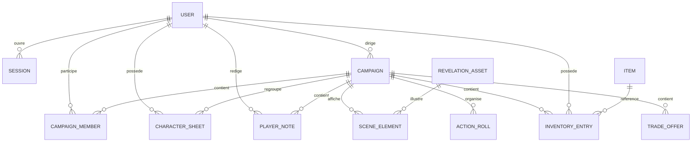

# MCD / MLD / MPC

## Objectif

Centraliser le modele de donnees du projet dans le dossier `docs/shema`.

## Competences demontrees

- Conception d'une base de donnees relationnelle
- Identification des entites metier
- Mise en place des relations et contraintes
- Traduction du modele vers un schema physique Prisma / PostgreSQL

## Reference

Le modele complet et a jour est maintenu dans :

- `docs/uml/mcd-mpc.md`

Le fichier `docs/uml/mcd-mpc.md` contient :

- le MCD conceptuel
- le MLD relationnel
- le MPC / MPD aligne sur Prisma
- les regles de gestion
- les ecarts entre le besoin initial et le MVP implemente

## Vue simplifiee du modele

## Points a presenter au jury

- Le role de l'utilisateur dans une campagne est porte par `CampaignMember`.
- Un joueur ne peut avoir qu'une seule fiche personnage par campagne.
- Les elements visibles par les joueurs sont filtres avec `SceneElement.isVisible`.
- Les sessions sont persistantes en base et associees a un utilisateur.

