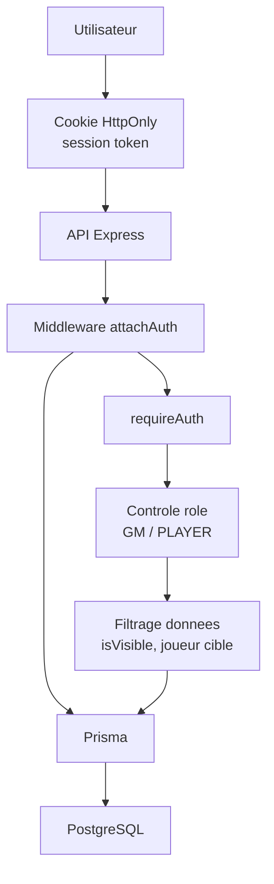

# Schema de securite

## Objectif

Montrer les mecanismes principaux de securite de l'application.

## Competences demontrees

- Developpement d'une application securisee
- Gestion des sessions
- Controle des droits
- Confidentialite des donnees selon le role

## Mesures presentes

- Mots de passe hashes avec `scrypt`.
- Comparaison securisee avec `timingSafeEqual`.
- Sessions stockees en base sous forme de `tokenHash`.
- Cookie de session `HttpOnly`.
- Middleware d'authentification centralise.
- Verification de l'appartenance a une campagne avant acces.
- Verification du role MJ pour les actions sensibles.
- Filtrage des elements invisibles pour les joueurs.

## Points d'amelioration possibles

- Politique de complexite de mot de passe plus stricte.
- Renouvellement et invalidation multi-appareil des sessions.
- Journalisation des actions sensibles.
- Tests de securite automatises sur les routes protegees.

