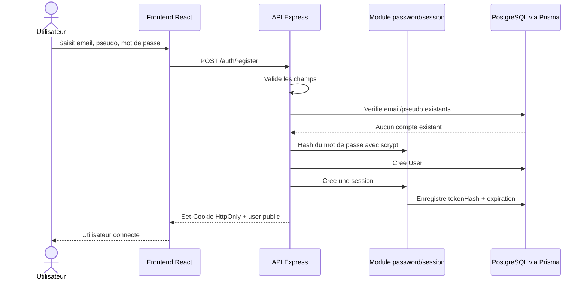
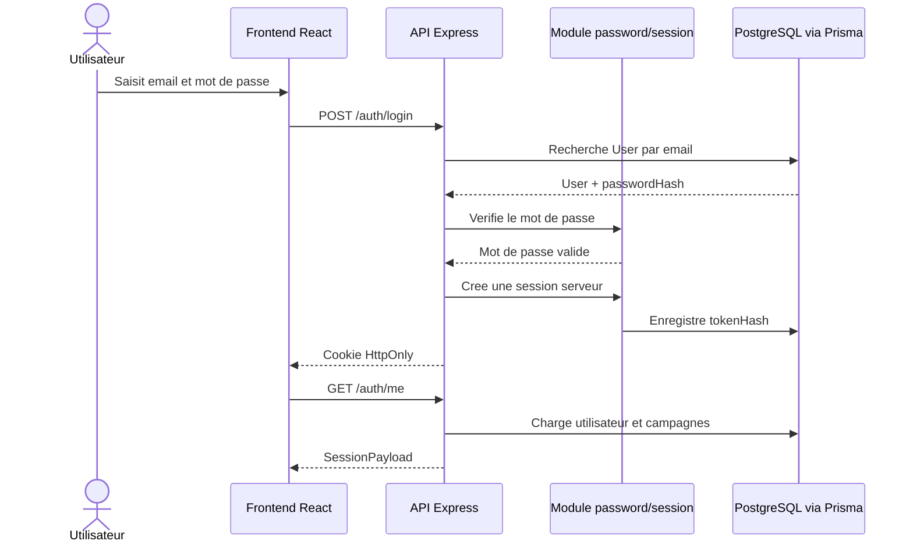

# Sequence d'authentification

## Objectif

Montrer le fonctionnement de l'inscription, de la connexion et de la session serveur.

## Competences demontrees

- Developpement d'une application securisee
- Gestion des mots de passe
- Gestion des sessions
- Protection par cookie `HttpOnly`

## Variante connexion

## Points de securite

- Le mot de passe n'est jamais stocke en clair.
- Le cookie de session est `HttpOnly`, donc non lisible directement par JavaScript.
- Les routes protegees utilisent `requireAuth`.

