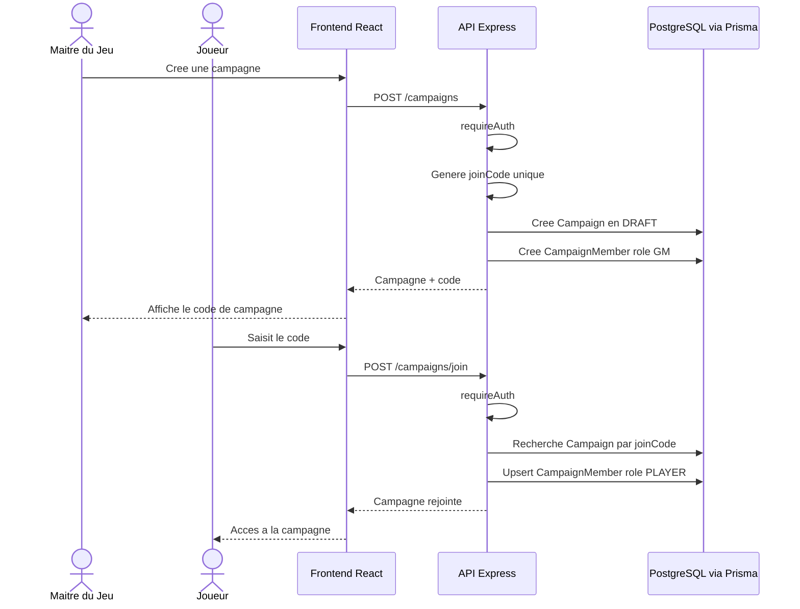
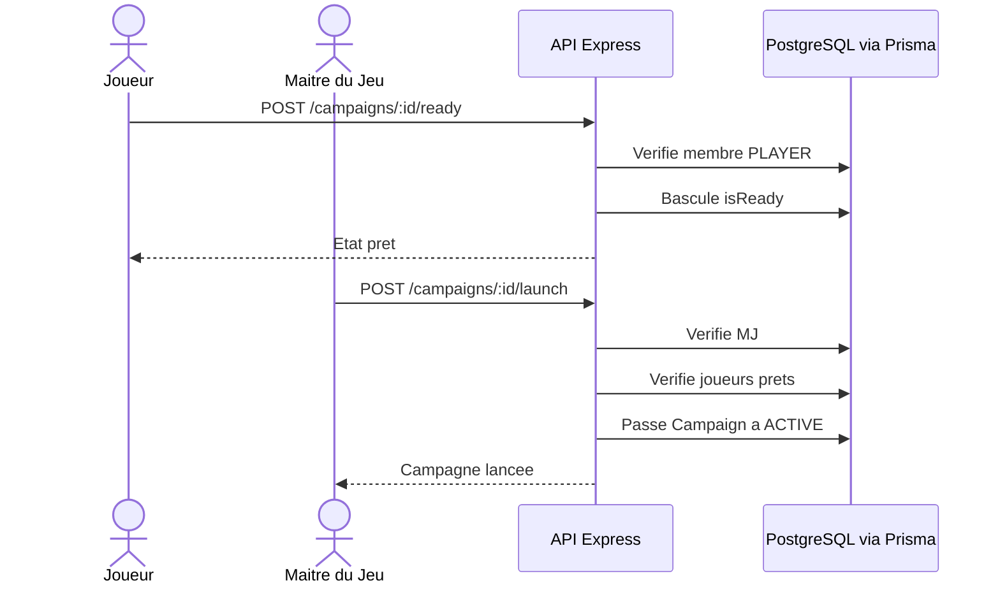

# Sequence creation et entree dans une campagne

## Objectif

Montrer le workflow permettant au MJ de creer une campagne et au joueur de la rejoindre.

## Competences demontrees

- Developpement de composants metier
- Gestion des roles
- Acces aux donnees relationnelles
- Validation des regles metier

## Lancement de campagne

