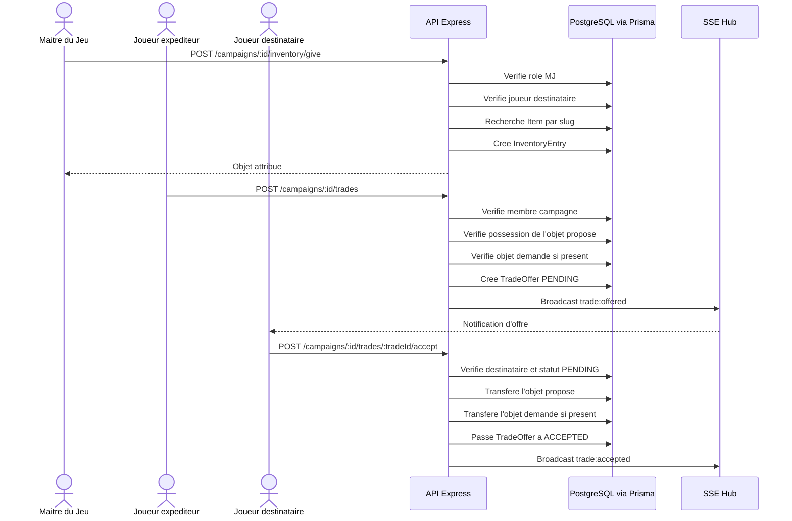

# Sequence inventaire et echange d'objets

## Objectif

Montrer la gestion de l'inventaire, le don direct et l'echange entre joueurs.

## Competences demontrees

- Developpement de regles metier
- Controle des droits
- Mise a jour transactionnelle des donnees metier
- Synchronisation par evenement SSE

## Regles importantes

- Un joueur ne peut pas echanger avec lui-meme.
- L'expediteur doit posseder l'objet propose.
- Le destinataire doit posseder l'objet demande si l'echange en demande un.
- Une offre acceptee annule les offres concurrentes sur le meme objet.

