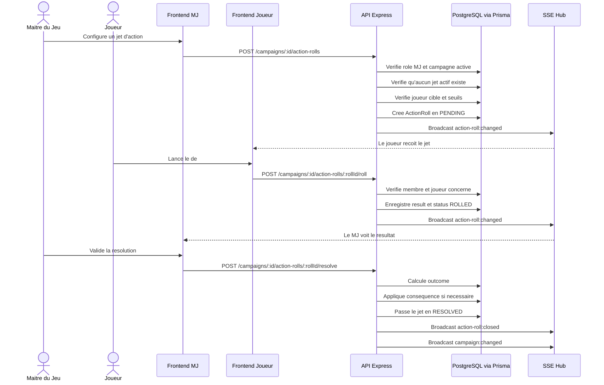

# Sequence jet d'action

## Objectif

Montrer le cycle complet d'un jet d'action : demande du MJ, jet du joueur, resolution et consequence.

## Competences demontrees

- Developpement de composants metier
- Validation des entrees
- Application de regles metier
- Synchronisation temps reel
- Mise a jour de donnees relationnelles

## Consequences possibles

- Ajout d'une narration dans la scene.
- Degats sur un element de scene.
- Degats sur un joueur.
- Suppression d'une cible.
- Aucune consequence automatique.

