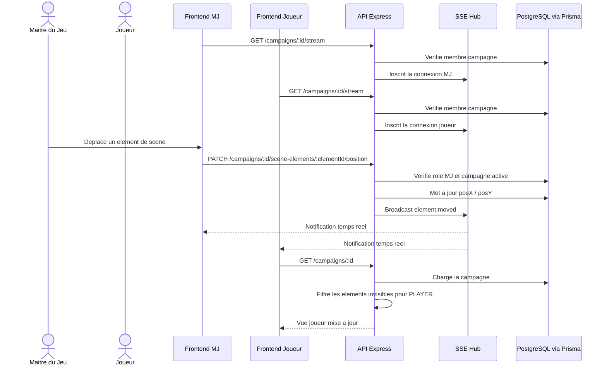

# Sequence scene temps reel avec SSE

## Objectif

Montrer comment le MJ modifie une scene et comment les clients sont synchronises.

## Competences demontrees

- Echanges client / serveur
- Communication temps reel
- Filtrage des donnees selon le role
- Developpement d'une application interactive

## Points a presenter

- SSE evite au frontend de rafraichir en boucle.
- Le serveur reste la source de verite.
- Le filtrage de visibilite est fait cote backend.

