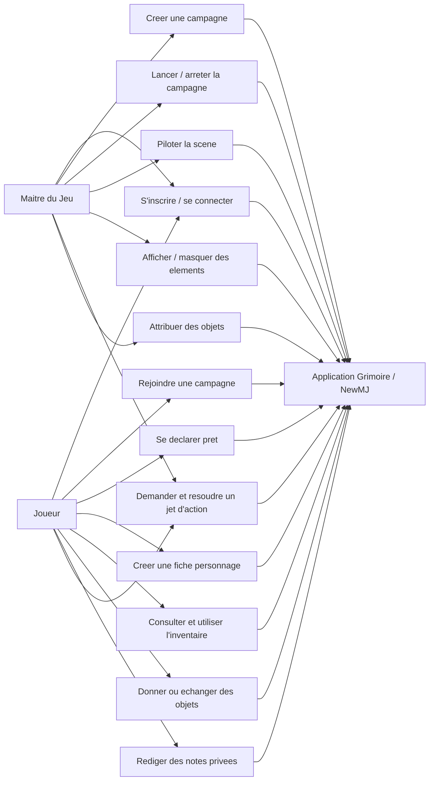

# Diagramme de cas d'utilisation

## Objectif

Montrer les interactions principales entre les deux profils utilisateurs : le Maitre du Jeu et le joueur.

## Competences demontrees

- Analyse des besoins utilisateur
- Identification des acteurs
- Definition du perimetre fonctionnel du MVP
- Prise en compte des droits selon le role

## Points a presenter au jury

- Le MJ garde le controle de la campagne et de la visibilite.
- Le joueur interagit uniquement avec les fonctionnalites autorisees.
- Les droits sont verifies cote serveur, pas uniquement dans l'interface.

