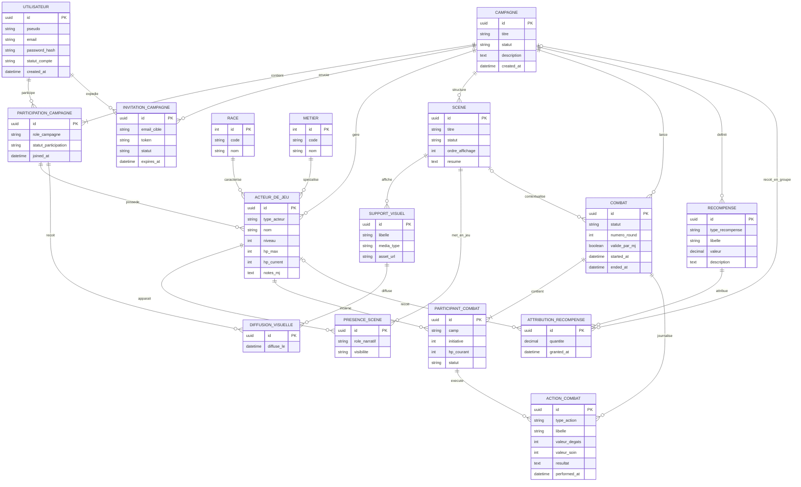

# Analyse du projet - MCD et MPC

## Source d'analyse

Le depot ne contient pas encore de code applicatif, de schema SQL ou de modele ORM.
Le present livrable est donc derive du besoin fonctionnel decrit dans `projet.txt`.

## Hypotheses de conception

- Un utilisateur peut etre MJ dans une campagne et joueur dans une autre.
- Une campagne possede un MJ principal.
- Les personnages joueurs, PNJ et monstres sont regroupes dans une entite technique commune `ActeurDeJeu`.
- Un `ActeurDeJeu` de type `PLAYER_CHARACTER` appartient a un joueur de la campagne.
- Un combat est rattache a une campagne et peut etre rattache a une scene.
- Les visuels diffuses aux joueurs sont traces pour gerer la visibilite.
- Une recompense peut etre attribuee a un personnage ou au groupe de campagne.

## MCD

### Entites principales

- `Utilisateur` : compte de connexion.
- `Campagne` : partie geree par le MJ.
- `ParticipationCampagne` : association entre un utilisateur et une campagne, avec son role.
- `InvitationCampagne` : invitation d'un joueur dans une campagne.
- `Race` : referentiel de races.
- `Metier` : referentiel de metiers / classes.
- `ActeurDeJeu` : personnage joueur, PNJ ou monstre.
- `Scene` : unite narrative d'une campagne.
- `SupportVisuel` : image, decor ou carte associee a une scene.
- `DiffusionVisuelle` : trace de ce qu'un joueur a le droit de voir.
- `PresenceScene` : apparition d'un acteur dans une scene.
- `Combat` : affrontement lance par le MJ.
- `ParticipantCombat` : participant concret d'un combat.
- `ActionCombat` : action ou resolution effectuee pendant un combat.
- `Recompense` : recompense definie par le MJ.
- `AttributionRecompense` : attribution d'une recompense a un personnage ou au groupe.

### Cardinalites et regles metier

- Un `Utilisateur` participe a 0,n campagnes.
- Une `Campagne` possede 1,n participations.
- Une `Campagne` a exactement 1 MJ principal actif.
- Une `ParticipationCampagne` de role `JOUEUR` peut posseder 0,n acteurs de type `PLAYER_CHARACTER`.
- Une `Campagne` contient 0,n scenes, 0,n acteurs et 0,n combats.
- Une `Scene` peut afficher 0,n supports visuels et 0,n acteurs.
- Un `Combat` contient 2,n participants.
- Une `ActionCombat` est validee par le MJ.
- Une `Recompense` peut etre attribuee a 0,n personnages ou 0,1 groupe de campagne.

### Diagramme conceptuel

## Regles de gestion a citer dans le dossier

- Un utilisateur ne peut etre present qu'une seule fois par campagne.
- Un seul MJ actif doit etre defini par campagne.
- Seuls les membres d'une campagne peuvent recevoir une diffusion visuelle.
- Un personnage joueur doit appartenir a un membre de campagne de role `JOUEUR`.
- Un PNJ ou un monstre appartient a une campagne mais n'a pas de proprietaire joueur.
- Un combat ne peut pas etre clos sans validation du MJ.
- Une recompense peut etre modifiee par le MJ avant attribution.
- Une attribution de recompense doit viser soit un personnage, soit la campagne entiere.

## MPC / MPD cible

Le schema physique ci-dessous est prevu pour une base relationnelle de type PostgreSQL.
Les types restent adaptables si tu pars sur MySQL ou SQLite.

### 1. `users`

- `id UUID PRIMARY KEY`
- `email VARCHAR(190) NOT NULL UNIQUE`
- `username VARCHAR(80) NOT NULL UNIQUE`
- `password_hash TEXT NOT NULL`
- `status VARCHAR(20) NOT NULL DEFAULT 'ACTIVE'`
- `created_at TIMESTAMP NOT NULL`
- `updated_at TIMESTAMP NOT NULL`

### 2. `campaigns`

- `id UUID PRIMARY KEY`
- `gm_user_id UUID NOT NULL REFERENCES users(id)`
- `title VARCHAR(120) NOT NULL`
- `description TEXT NULL`
- `status VARCHAR(20) NOT NULL CHECK (status IN ('DRAFT','ACTIVE','PAUSED','CLOSED'))`
- `created_at TIMESTAMP NOT NULL`
- `updated_at TIMESTAMP NOT NULL`

### 3. `campaign_members`

- `id UUID PRIMARY KEY`
- `campaign_id UUID NOT NULL REFERENCES campaigns(id)`
- `user_id UUID NOT NULL REFERENCES users(id)`
- `role VARCHAR(20) NOT NULL CHECK (role IN ('GM','PLAYER'))`
- `status VARCHAR(20) NOT NULL CHECK (status IN ('INVITED','ACTIVE','LEFT','BANNED'))`
- `joined_at TIMESTAMP NULL`
- `UNIQUE (campaign_id, user_id)`

Contrainte metier recommandee :

- index unique partiel sur `campaign_id` pour garantir un seul `GM` actif

### 4. `campaign_invitations`

- `id UUID PRIMARY KEY`
- `campaign_id UUID NOT NULL REFERENCES campaigns(id)`
- `invited_by_user_id UUID NOT NULL REFERENCES users(id)`
- `target_email VARCHAR(190) NOT NULL`
- `token CHAR(64) NOT NULL UNIQUE`
- `status VARCHAR(20) NOT NULL CHECK (status IN ('PENDING','ACCEPTED','EXPIRED','CANCELLED'))`
- `expires_at TIMESTAMP NOT NULL`
- `created_at TIMESTAMP NOT NULL`

### 5. `races`

- `id SERIAL PRIMARY KEY`
- `code VARCHAR(40) NOT NULL UNIQUE`
- `name VARCHAR(80) NOT NULL UNIQUE`
- `description TEXT NULL`

### 6. `classes`

- `id SERIAL PRIMARY KEY`
- `code VARCHAR(40) NOT NULL UNIQUE`
- `name VARCHAR(80) NOT NULL UNIQUE`
- `description TEXT NULL`

### 7. `game_actors`

- `id UUID PRIMARY KEY`
- `campaign_id UUID NOT NULL REFERENCES campaigns(id)`
- `owner_member_id UUID NULL REFERENCES campaign_members(id)`
- `actor_type VARCHAR(30) NOT NULL CHECK (actor_type IN ('PLAYER_CHARACTER','NPC','MONSTER'))`
- `name VARCHAR(120) NOT NULL`
- `race_id INT NULL REFERENCES races(id)`
- `class_id INT NULL REFERENCES classes(id)`
- `level INT NOT NULL DEFAULT 1`
- `hp_max INT NOT NULL DEFAULT 0`
- `hp_current INT NOT NULL DEFAULT 0`
- `stats_json JSONB NOT NULL DEFAULT '{}'::jsonb`
- `mj_notes TEXT NULL`
- `is_active BOOLEAN NOT NULL DEFAULT TRUE`
- `created_at TIMESTAMP NOT NULL`
- `updated_at TIMESTAMP NOT NULL`

Contraintes metier recommandees :

- si `actor_type = 'PLAYER_CHARACTER'` alors `owner_member_id IS NOT NULL`
- si `actor_type IN ('NPC','MONSTER')` alors `owner_member_id IS NULL`

### 8. `scenes`

- `id UUID PRIMARY KEY`
- `campaign_id UUID NOT NULL REFERENCES campaigns(id)`
- `title VARCHAR(120) NOT NULL`
- `summary TEXT NULL`
- `gm_notes TEXT NULL`
- `display_order INT NOT NULL DEFAULT 0`
- `status VARCHAR(20) NOT NULL CHECK (status IN ('PREPARED','LIVE','ARCHIVED'))`
- `created_at TIMESTAMP NOT NULL`
- `updated_at TIMESTAMP NOT NULL`

### 9. `scene_visuals`

- `id UUID PRIMARY KEY`
- `scene_id UUID NOT NULL REFERENCES scenes(id)`
- `label VARCHAR(120) NOT NULL`
- `media_type VARCHAR(20) NOT NULL CHECK (media_type IN ('IMAGE','MAP','BACKGROUND'))`
- `asset_url TEXT NOT NULL`
- `created_at TIMESTAMP NOT NULL`

### 10. `visual_shares`

- `id UUID PRIMARY KEY`
- `visual_id UUID NOT NULL REFERENCES scene_visuals(id)`
- `member_id UUID NOT NULL REFERENCES campaign_members(id)`
- `granted_by_user_id UUID NOT NULL REFERENCES users(id)`
- `granted_at TIMESTAMP NOT NULL`
- `UNIQUE (visual_id, member_id)`

### 11. `scene_actor_links`

- `id UUID PRIMARY KEY`
- `scene_id UUID NOT NULL REFERENCES scenes(id)`
- `actor_id UUID NOT NULL REFERENCES game_actors(id)`
- `narrative_role VARCHAR(30) NULL`
- `visibility_scope VARCHAR(20) NOT NULL CHECK (visibility_scope IN ('GM_ONLY','ALL_PLAYERS'))`
- `UNIQUE (scene_id, actor_id)`

### 12. `combats`

- `id UUID PRIMARY KEY`
- `campaign_id UUID NOT NULL REFERENCES campaigns(id)`
- `scene_id UUID NULL REFERENCES scenes(id)`
- `initiated_by_user_id UUID NOT NULL REFERENCES users(id)`
- `status VARCHAR(20) NOT NULL CHECK (status IN ('PLANNED','LIVE','PAUSED','ENDED'))`
- `round_no INT NOT NULL DEFAULT 1`
- `mj_validated BOOLEAN NOT NULL DEFAULT FALSE`
- `started_at TIMESTAMP NULL`
- `ended_at TIMESTAMP NULL`

### 13. `combat_participants`

- `id UUID PRIMARY KEY`
- `combat_id UUID NOT NULL REFERENCES combats(id)`
- `actor_id UUID NOT NULL REFERENCES game_actors(id)`
- `side VARCHAR(20) NOT NULL CHECK (side IN ('PLAYERS','OPPONENTS','NEUTRAL'))`
- `initiative INT NULL`
- `current_hp INT NOT NULL`
- `status VARCHAR(20) NOT NULL CHECK (status IN ('READY','ACTIVE','KO','DEAD','FLED'))`
- `UNIQUE (combat_id, actor_id)`

### 14. `combat_actions`

- `id UUID PRIMARY KEY`
- `combat_id UUID NOT NULL REFERENCES combats(id)`
- `source_participant_id UUID NOT NULL REFERENCES combat_participants(id)`
- `target_participant_id UUID NULL REFERENCES combat_participants(id)`
- `action_type VARCHAR(30) NOT NULL CHECK (action_type IN ('ATTACK','SPELL','ITEM','DEFEND','MANUAL_ADJUST','FLEE'))`
- `action_label VARCHAR(120) NOT NULL`
- `damage_value INT NULL`
- `healing_value INT NULL`
- `result_text TEXT NULL`
- `validated_by_user_id UUID NOT NULL REFERENCES users(id)`
- `performed_at TIMESTAMP NOT NULL`

### 15. `rewards`

- `id UUID PRIMARY KEY`
- `campaign_id UUID NOT NULL REFERENCES campaigns(id)`
- `created_by_user_id UUID NOT NULL REFERENCES users(id)`
- `reward_type VARCHAR(20) NOT NULL CHECK (reward_type IN ('XP','ITEM','GOLD','STORY','CUSTOM'))`
- `label VARCHAR(120) NOT NULL`
- `description TEXT NULL`
- `numeric_value NUMERIC(10,2) NULL`
- `created_at TIMESTAMP NOT NULL`

### 16. `reward_assignments`

- `id UUID PRIMARY KEY`
- `reward_id UUID NOT NULL REFERENCES rewards(id)`
- `campaign_id UUID NOT NULL REFERENCES campaigns(id)`
- `actor_id UUID NULL REFERENCES game_actors(id)`
- `granted_by_user_id UUID NOT NULL REFERENCES users(id)`
- `combat_id UUID NULL REFERENCES combats(id)`
- `scene_id UUID NULL REFERENCES scenes(id)`
- `quantity NUMERIC(10,2) NOT NULL DEFAULT 1`
- `granted_at TIMESTAMP NOT NULL`

Contrainte metier recommandee :

- `actor_id IS NULL` signifie attribution au groupe de campagne

## Lecture rapide du modele

- `users`, `campaigns`, `campaign_members` couvrent l'authentification et les roles.
- `game_actors` couvre a la fois les personnages joueurs, PNJ et monstres.
- `scenes`, `scene_visuals`, `visual_shares` couvrent la narration et la visibilite.
- `combats`, `combat_participants`, `combat_actions` couvrent la gestion de combat.
- `rewards`, `reward_assignments` couvrent la proposition et l'attribution des recompenses.

## Conclusion

Pour ton dossier professionnel, ce modele est coherent avec le MVP decrit dans `projet.txt` et
montre que tu sais :

- analyser le besoin
- isoler les entites metier
- gerer les roles et les droits
- proposer une persistance relationnelle exploitable
- preparer la suite du developpement

Si tu veux, l'etape suivante logique est de te produire soit :

- un `MLD` formel en notation relationnelle
- un `script SQL PostgreSQL`
- un `schema Prisma`
- ou un `diagramme UML de cas d'utilisation` pour le dossier
